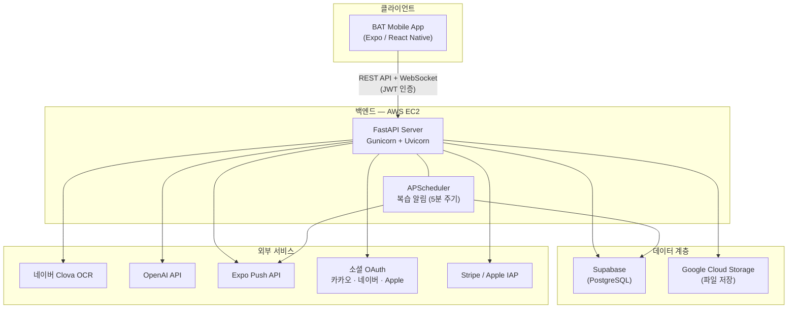
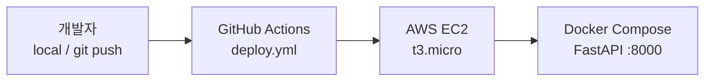

# BAT — 학습·복습 관리 앱

**문서 스캔 → OCR → 핵심 키워드·빈칸 학습 → 퀴즈·리워드·통계·복습 알림**까지 이어지는 학습 앱 프로젝트입니다.

프론트엔드와 백엔드를 **별도 저장소(Multi-repo)** 로 운영하며, 모바일 앱은 백엔드 REST API를 통해 학습 데이터·인증·알림 등을 처리합니다.

---

## 팀원 소개 및 역할 분담

| 이름 | 역할 | 담당 영역 |
|------|------|-----------|
| **김다빈** | 백엔드 | FastAPI 서버, OCR·채점·리워드 API, 인증, 배포 인프라 |
| **홍재영** | 프론트엔드 | Expo React Native 앱, 화면·네비게이션, API 연동 |
| **김예진** | PM | 기획, 일정·요구사항 관리, 팀 커뮤니케이션 |
| **김소은** | 디자이너 | UI/UX 디자인, 화면 시안·에셋 |

---

## 멀티 레포 구조 (Multi-repo)

이 프로젝트는 프론트엔드와 백엔드를 분리한 **Multi-repo** 구조입니다.

| 저장소 | 기술 스택 | 설명 |
|--------|-----------|------|
| [**front**](https://github.com/Batman-sasac/front) | Expo / React Native / TypeScript | 모바일 클라이언트 — OCR 촬영, 학습·복습 UI, 소셜 로그인 |
| [**python**](https://github.com/Batman-sasac/python) *(현재 저장소)* | FastAPI / Python 3.11 | REST API 서버 — OCR, 채점, 리워드, 통계, 푸시 알림 |

```text
BAT 프로젝트
├── front/          → Expo React Native 앱 (클라이언트)
└── python/         → FastAPI 백엔드 API (현재 레포)
```

---

## 전체 아키텍처 및 시스템 구조



### 핵심 데이터 흐름

```text
[사용자] → 앱에서 학습지 촬영/업로드
    → POST /ocr (Clova OCR + 키워드 추출)
    → POST /study/grade (채점 · 포인트 · 학습 로그 저장)
    → GET /study/review_study/{quiz_id} (복습 HTML)
    → APScheduler → Expo Push (복습 리마인드 알림)
```

### 배포 구조



---

## 나의 핵심 기여도 (My Contributions)

> **김다빈** — 백엔드 전담

### 1. FastAPI 백엔드 아키텍처 설계 및 구현

- `main.py`를 중심으로 **모듈형 APIRouter** 구조를 설계하고, 인증·OCR·학습·리워드·알림·결제 등 도메인별 라우터를 분리해 유지보수성을 확보했습니다.
- CORS, JWT 미들웨어, 정적 파일 마운트, APScheduler 스케줄러를 앱 라이프사이클에 통합했습니다.

### 2. 인증 시스템 (JWT + 소셜 OAuth)

- `app/security_app.py` — JWT 발급·검증, `get_current_user` 의존성 주입
- `app/auth/` — **카카오 · 네이버 · Apple** 소셜 로그인 콜백 및 토큰 교환 → JWT 발급
- `GET /config` — 프론트엔드 OAuth 설정을 환경 변수 기반으로 동적 제공

### 3. OCR 파이프라인 (네이버 Clova OCR)

- `service/clova_ocr_service.py` — Clova OCR API 연동, 이미지/PDF 처리, 2열 레이아웃 보정(`OCR_TWO_COLUMN_LAYOUT`)
- `app/ocr_app.py` — OCR 업로드, 사용량 한도, 키워드 추출(`POST /ocr/keywords`), 비동기 job 폴링
- `app/ocr_ws.py` — **WebSocket** 기반 OCR 진행률 실시간 push (`/ws/ocr/{job_id}`)
- `service/keyword_adapter.py` — OpenAI + kiwipiepy 형태소 분석을 활용한 키워드 추출

### 4. 학습·채점·복습 시스템

- `app/study_app.py` — 최초 채점(`POST /study/grade`), 복습 HTML 렌더링, 복습 채점, 페이지별 통계 기록
- `app/hint/` — 복습 힌트 API
- `templates/` — Jinja2 기반 복습 HTML 템플릿

### 5. 리워드·게이미피케이션

- `app/reward_app.py` + `service/reward_service.py` — 출석 보상, **연속 학습 보너스**, 날짜 랜덤 이벤트, 리더보드·순위 조회
- 채점 응답에 `streak_bonus`, `consecutive_streak_days` 등 스트릭 정보 포함

### 6. 학습 통계·목표 관리

- `app/weekly_app.py` — 월간 학습 목표 설정, 주간 성장률, 이번 달 학습 vs 목표 통계
- `app/user_app.py` — 닉네임 설정, 홈·학습 통계 API

### 7. 푸시 알림 시스템

- `service/notification_service.py` — APScheduler **5분 주기** DB 조회 → 복습 리마인드 Expo Push 발송
- `remind_sent_at` 기반 당일 중복 발송 방지, Supabase 연결 재시도 로직
- `app/notification_app.py` — 알림 on/off, 리마인드 시간 설정 API
- `app/firebase_app.py` — Expo Push 토큰 등록

### 8. 결제 연동

- `app/apple_pay/` — Stripe PaymentIntent 생성 + Webhook 서명 검증
- `app/iap/` — Apple StoreKit IAP 검증, OCR 페이지 상한 증가

### 9. 인프라·배포 (AWS EC2 + Docker + CI/CD)

- `Dockerfile` — Python 3.11-slim, Gunicorn + UvicornWorker, OCR/PDF 의존성
- `docker-compose.yaml` — 컨테이너 오케스트레이션, DNS 설정
- `.github/workflows/deploy.yml` — **GitHub Actions** → EC2 SSH 배포, `.env` 자동 생성, Docker Compose 재빌드
- 운영 서버: `http://13.209.6.39:8000`

### 10. 데이터베이스·스토리지

- `core/database.py` — Supabase(PostgreSQL) 클라이언트, service_role 키 기반 RLS 우회
- `utils/file_handler.py` — Google Cloud Storage 파일 업로드·처리
- `app/reports_app.py` — 학습 신고·피드백 API

---

## API 명세서 (API Documentation)

Swagger UI에서 전체 API 엔드포인트를 확인할 수 있습니다.

**[http://13.209.6.39:8000/docs](http://13.209.6.39:8000/docs)**

### 주요 API 그룹

| 그룹 | Prefix | 설명 |
|------|--------|------|
| 인증·사용자 | `/auth` | 소셜 로그인, 닉네임, 통계 |
| OCR | `/ocr` | 업로드, 키워드, 사용량, job 폴링 |
| 학습·채점 | `/study` | 채점, 복습, 힌트 |
| 리워드 | `/reward` | 출석, 랜덤 이벤트, 리더보드 |
| 통계·목표 | `/cycle` | 월 목표, 주간·월간 통계 |
| 알림 | `/notification-push`, `/firebase` | 알림 설정, 푸시 토큰 |
| 결제 | `/payments`, `/iap` | Stripe, Apple IAP |
| 신고 | `/reports` | 학습 신고·피드백 |

상세 필드·요청/응답 형식은 [docs/API.md](./docs/API.md)를 참고하세요.

---

## 기술 스택

| 영역 | 기술 |
|------|------|
| Framework | FastAPI, APIRouter 모듈화 |
| Runtime | Python 3.11, uvicorn(개발) / gunicorn+uvicorn(운영) |
| Database | Supabase (PostgreSQL) |
| Auth | JWT, 카카오/네이버/Apple OAuth |
| OCR | 네이버 Clova OCR |
| NLP | OpenAI API, kiwipiepy |
| Push | Expo Push API |
| Payments | Stripe, Apple StoreKit IAP |
| Storage | Google Cloud Storage |
| Scheduler | APScheduler (복습 알림) |
| Infra | AWS EC2, Docker, GitHub Actions |

---

## 디렉토리 구조

```text
python/
├── main.py                  # FastAPI 앱 진입점, CORS, 스케줄러
├── Dockerfile / docker-compose.yaml
├── requirements.txt / .env.example
├── app/                     # API 라우터
│   ├── security_app.py      # JWT
│   ├── auth/                # 카카오·네이버·Apple 로그인
│   ├── ocr_app.py / ocr_ws.py
│   ├── study_app.py
│   ├── reward_app.py / weekly_app.py / user_app.py
│   ├── notification_app.py / firebase_app.py
│   ├── apple_pay/ / iap/
│   └── hint/ / reports_app.py
├── core/                    # Supabase 클라이언트, env 로더
├── service/                 # OCR, 알림, 리워드, 키워드 비즈니스 로직
├── utils/                   # GCS 파일 처리
├── templates/               # Jinja2 (복습 HTML)
├── docs/                    # API, OCR, 알림 상세 문서
└── tests/
```

---

## 실행 방법

```bash
# 1. 가상환경 및 패키지
python -m venv .venv
source .venv/bin/activate
pip install -r requirements.txt

# 2. 환경 변수 (.env.example 참고)
cp .env.example .env   # 값 채우기

# 3. 개발 서버
uvicorn main:app --reload

# 4. Docker
docker compose up --build -d
```

동작 확인: `GET /` → `{"status":"running"}`

---

## 관련 문서

- [docs/API.md](./docs/API.md) — API·필드 상세
- [docs/OCR.md](./docs/OCR.md) — OCR 저장 형식·스키마
- [docs/OCR_PROGRESS_WS.md](./docs/OCR_PROGRESS_WS.md) — OCR WebSocket
- [docs/NOTIFICATION_FLOW.md](./docs/NOTIFICATION_FLOW.md) — 알림·DB 필드
- [Frontend Repo](https://github.com/Batman-sasac/front) — 모바일 앱 저장소
