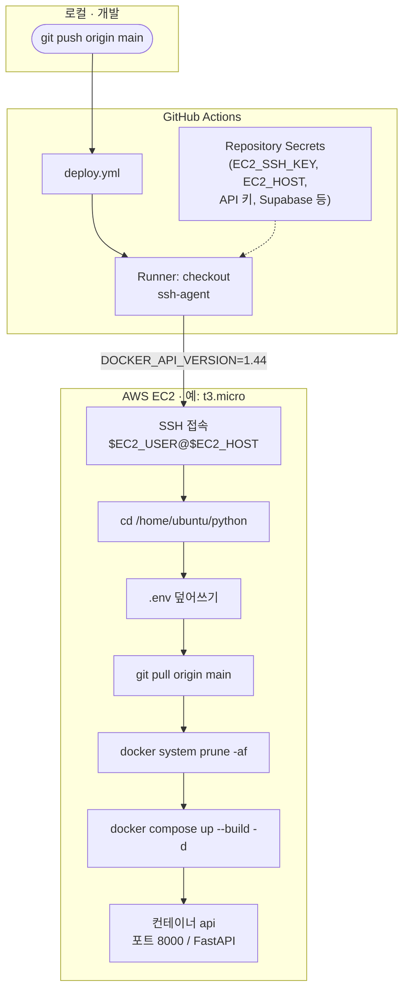
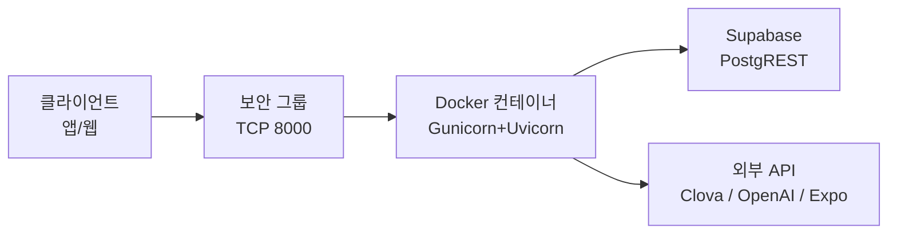

## 프로젝트 개요

이 레포지토리는 **학습/복습 관리 앱의 백엔드 서버**입니다.  
이미지·PDF OCR로 학습지를 인식하고, 채점·복습·리워드(포인트)·주간 통계·푸시 알림 등을 제공하는 **FastAPI 기반 REST API**입니다.  
클라이언트(모바일/웹)는 이 서버의 API를 호출해 로그인, 학습 데이터 저장, 통계 조회, 알림 설정 등을 수행합니다.

**OCR 엔진**: 표·체크박스가 함께 있는 학습지 영역에서 **네이버 클로바 OCR**이 상대적으로 안정적이라 백엔드 OCR 연동으로 사용합니다.  
키워드·퀴즈 생성 등 일부 NLP는 **OpenAI API**와 형태소 분석(**kiwipiepy**) 등을 사용합니다.

## 기술 스택

- **Framework**: FastAPI, APIRouter 모듈화
- **실행**: 로컬 `uvicorn`, 운영 **`gunicorn` + `uvicorn.workers.UvicornWorker`** (`Dockerfile` 참고)
- **Scheduler**: APScheduler — 복습 알림 **5분마다** (`main.py`, `cron` `*/5`)
- **Database**: Supabase(PostgreSQL), Python `supabase` 클라이언트
- **Auth**: JWT (`Authorization: Bearer <token>`), 소셜 OAuth(카카오 / 네이버 / 애플)
- **Push (iOS)**: Expo Push API, `ExponentPushToken[...]`
- **OCR**: 클로바 OCR (`CLOVA_OCR_URL`, `CLOVA_OCR_SECRET`), 선택적 2열 레이아웃 보정(`OCR_TWO_COLUMN_LAYOUT`)
- **스토리지**: Google Cloud Storage (`GCS_BUCKET_NAME`, `utils/file_handler.py`) — 업로드/파일 처리에 사용 시
- **기타**: Pillow, pdf2image, pypdf, requests, httpx(의존성), python-dotenv, psycopg2-binary

## 디렉토리 구조

- `main.py` — FastAPI 앱, CORS, 라우터 등록, APScheduler(알림), `/`·`/config`
- `Dockerfile` / `docker-compose.yaml` — 컨테이너 빌드·실행(선택: 공용 DNS `8.8.8.8`, `1.1.1.1`)
- `requirements.txt` — Python 의존성
- `.env.example` — 로컬용 환경 변수 예시(필수 항목은 아래 **환경 변수** 참고)

- `core/database.py` — Supabase 클라이언트 (`SUPABASE_URL`, **`SUPABASE_SERVICE_ROLE_KEY` 우선**, 없으면 `SUPABASE_ANON_KEY`). 서버에서 insert 후 `id` 반환·RLS 우회가 필요하면 **service_role** 권장.
- `app/logging_config.py` — 로깅 설정 (`LOG_LEVEL`)

- `app/security_app.py` — JWT 발급/검증, `get_current_user`
- `app/user_app.py` — 닉네임, 통계 (`/auth/...`)
- `app/study_app.py` — 채점, 복습 HTML, 학습 로그 (`/study/...`)
- `app/weekly_app.py` — 월 목표, 주간·월간 통계 (`/cycle/...`)
- `app/reward_app.py` — 출석, 랜덤 이벤트, 리더보드·내 순위 (`/reward/...`)
- `app/ocr_app.py` — OCR, 사용량, 목록, 키워드 API, `job_id` 폴링, **WebSocket** `/ws/ocr/{job_id}` 핸들러
- `app/ocr_ws.py` — OCR 진행률 WS 매니저(로직·문서)
- `app/notification_app.py` — 알림 on/off·리마인드 시간 (`/notification-push/...`)
- `app/firebase_app.py` — Expo 푸시 토큰 등록 (`/firebase/...`)
- `app/reports_app.py` — 신고·피드백 (`/reports/...`)
- `app/auth/` — 카카오·네이버·애플 로그인
- `app/hint/` — 복습 힌트 API

- `service/clova_ocr_service.py` — 클로바 OCR 연동
- `service/keyword_adapter.py` — 키워드 추출 등(텍스트 기반)
- `service/ocr_usage_service.py` — OCR 사용량 한도
- `service/notification_service.py` — 알림 대상 조회, Expo Push, `NOTIFICATION_SIMULATE`, Supabase 연결 **재시도**(일시 DNS/연결 오류)
- `service/reward_service.py` — 연속 학습 보너스 등
- `service/josa_strip.py` — 조사 처리 등 보조

- `utils/file_handler.py` — GCS 등 파일 처리
- `templates/` — Jinja2 (복습 HTML 등)
- `static/` — 있으면 `main.py`에서 `/static` 마운트
- `docs/` — `API.md`, `OCR.md`, `OCR_PROGRESS_WS.md`, `NOTIFICATION_FLOW.md`
- `tests/` — pytest 등
- `.github/workflows/deploy.yml` — EC2 SSH 배포, `.env` 생성

## 주요 기능 요약

- **인증/사용자**: JWT, 소셜 로그인 후 사용자 저장, 닉네임·학습/홈 통계
- **OCR & 학습**: 이미지/PDF 업로드, crop OCR, 클로바 결과 저장, 사용량 한도, `POST /ocr/keywords`로 텍스트만 키워드 추출, `GET /ocr/job/{job_id}`로 비동기 job 상태 조회(인메모리 MVP)
- **채점·복습**: `study_logs` / `reward_history` / `users.points`, 복습 채점, 힌트, 퀴즈 JSON·HTML
- **리워드**: 출석, 연속 학습 보너스, **날짜 랜덤 이벤트**(`RANDOM_EVENT_*`), 리더보드, 본인 순위
- **통계**: 주간 성장, 이번 달 학습 vs 목표, 홈 지표
- **알림**: 5분 스케줄로 DB 조회 후 Expo Push, `remind_sent_at`으로 당일 중복 방지, 시뮬레이션 모드

## 추가·보강된 기능

- **연속 학습 보너스**: `reward_service` — 연속 학습일 ≥ 2일 등 조건 시 보너스 포인트(당일 1회). 채점 응답에 `streak_bonus`, `consecutive_streak_days` 등(자세한 필드는 `docs/API.md`).
- **페이지 단위 채점 통계**: 초기 채점 시 페이지별 정답·문항 수 기록.
- **`POST /ocr/estimate`**: 업로드 기준 예상 페이지·시간.
- **OCR WebSocket**: `OCR_PROGRESS_WS=1` 등 환경에 따라 진행률 push. 연동은 `docs/OCR_PROGRESS_WS.md`.
- **랜덤 이벤트 리워드**: `RANDOM_EVENT_ENABLED=1`일 때 `POST /reward/random-event`.
- **학습 신고**: `POST /reports/submitted-report`.
- **Expo 푸시 토큰**: `POST /firebase/user/update-fcm-token`.

## API 엔드포인트 정리

### 공통

- **Base URL**: 배포 도메인 또는 `http://127.0.0.1:8000`
- **인증**: 별도 없으면 `Authorization: Bearer <JWT>`

### 인증·사용자 (`/auth`)

| Method | Path | 설명 | 비고 |
|--------|------|------|------|
| GET | `/config` | OAuth용 공개 설정 | 공개 |
| POST | `/auth/set-nickname` | 닉네임 설정/변경 | JWT |
| GET | `/auth/user/stats` | 학습 통계 등 | JWT |
| GET | `/auth/home/stats` | 홈용 포인트·목표 등 | JWT |
| GET | `/auth/kakao/mobile` | 카카오 콜백 | 공개 |
| POST | `/auth/kakao/mobile` | 카카오 토큰 → JWT | 공개 |
| GET | `/auth/naver/mobile` | 네이버 콜백 | 공개 |
| POST | `/auth/naver/mobile` | 네이버 토큰 → JWT | 공개 |
| POST | `/auth/apple/mobile` | 애플 → JWT | 공개 |

### OCR·학습 데이터

| Method | Path | 설명 |
|--------|------|------|
| GET | `/ocr/usage` | OCR 사용량 |
| POST | `/ocr/estimate` | 예상 페이지·시간 |
| POST | `/ocr/keywords` | 텍스트에서 키워드 추출(JSON body) |
| POST | `/ocr` | OCR 업로드(Form, 선택 `job_id`, crop) |
| GET | `/ocr/job/{job_id}` | 비동기 job 상태/결과(MVP 인메모리) |
| WS | `/ws/ocr/{job_id}` | 진행률(WebSocket) |
| GET | `/ocr/quiz/{quiz_id}` | 복습 퀴즈 JSON |
| DELETE | `/ocr/ocr-data/delete/{quiz_id}` | 학습 데이터 삭제 |
| GET | `/ocr/list` | 학습 목록 |

### 학습·채점·복습 (`/study`)

| Method | Path | 설명 |
|--------|------|------|
| POST | `/study/grade` | 최초 채점·로그·리워드 |
| GET | `/study/review_study/{quiz_id}` | 복습 HTML |
| POST | `/study/review-study` | 복습 채점 |
| GET | `/study/hint/{quiz_id}` | 힌트 |

### 리워드 (`/reward`)

| Method | Path | 설명 |
|--------|------|------|
| POST | `/reward/attendance` | 출석 보상 |
| POST | `/reward/random-event` | 날짜 랜덤 이벤트(환경 변수로 on) |
| GET | `/reward/my-rank` | 본인 포인트 순위 |
| GET | `/reward/leaderboard` | 상위 랭킹 |

### 학습 목표·통계 (`/cycle`)

| Method | Path | 설명 |
|--------|------|------|
| POST | `/cycle/set-goal` | 월 목표 |
| GET | `/cycle/stats/weekly-growth` | 주간 성장 |
| GET | `/cycle/learning-stats` | 이번 달 vs 목표 |

### 알림·푸시

| Method | Path | 설명 |
|--------|------|------|
| POST | `/firebase/user/update-fcm-token` | Expo 푸시 토큰 |
| POST | `/notification-push/update` | 알림·리마인드 설정 |
| GET | `/notification-push/me` | 내 설정 조회 |

### 리포트 (`/reports`)

| Method | Path | 설명 |
|--------|------|------|
| POST | `/reports/submitted-report` | 신고·피드백 |

## 환경 변수

로컬은 `.env`(`.env.example` 참고). 아래는 코드·배포에서 쓰이는 이름 위주입니다.

| 변수 | 용도 |
|------|------|
| `SUPABASE_URL`, `SUPABASE_SERVICE_ROLE_KEY` / `SUPABASE_ANON_KEY` | DB·PostgREST (백엔드는 **service_role** 권장) |
| `JWT_SECRET_KEY` | JWT 서명 |
| `API_BASE_URL` | 없으면 `/config`에서 요청 호스트 사용 |
| `KAKAO_REST_API_KEY`, `KAKAO_CLIENT_SECRET`, `KAKAO_REDIRECT_URI` | 카카오 |
| `NAVER_CLIENT_ID`, `NAVER_CLIENT_SECRET`, `NAVER_REDIRECT_URI` | 네이버 |
| `APPLE_CLIENT_ID` 또는 `APPLE_BUNDLE_ID` | 애플 audience |
| `OPENAI_API_KEY` | OpenAI 호출 |
| `CLOVA_OCR_URL`, `CLOVA_OCR_SECRET` | 클로바 OCR |
| `CLOVA_OCR_READ_TIMEOUT`, `CLOVA_OCR_CONNECT_TIMEOUT` | (선택) 타임아웃 초 |
| `OCR_TWO_COLUMN_LAYOUT` | 2열 단어장 텍스트 병합 |
| `OCR_CONCURRENCY` | OCR 동시 처리 수 |
| `OCR_PROGRESS_WS` | 진행률 WS 등 켜기 |
| `OCR_KEYWORDS_MAX_CHARS` | 키워드 입력 길이 상한 |
| `GCS_BUCKET_NAME` | GCS 사용 시 |
| `NOTIFICATION_SIMULATE` | 알림 시뮬레이션 |
| `RANDOM_EVENT_ENABLED`, `RANDOM_EVENT_PROB`, `RANDOM_EVENT_SEED` | 랜덤 이벤트 |
| `LOG_LEVEL`, `UVICORN_LOG_LEVEL` | 로그 |
| `FIREBASE_CREDENTIALS` | 배포 워크플로에서 주입(Google 서비스 계정 JSON 문자열 등) — 용도는 인프라 설정에 따름 |
| `KAKAO_NATIVE_APP_KEY` | CI에서 `.env`에 기록(클라이언트용 등, 백엔드 직접 사용 여부는 앱 구성에 따름) |

GitHub Actions 배포 시 기본으로 EC2 `.env`에 쓰는 항목은 `.github/workflows/deploy.yml`을 참고하세요.

## 실행 방법

1. **가상환경 및 패키지**

   ```bash
   python -m venv .venv
   source .venv/bin/activate   # Windows: .venv\Scripts\activate
   pip install -r requirements.txt
   ```

2. **환경 변수**  
   프로젝트 루트에 `.env`를 두고 `main.py`의 `load_dotenv()`가 읽습니다.  
   Docker Compose만 쓸 때는 **`docker-compose.yaml`에 `env_file: .env`가 없으면** 컨테이너에 변수가 안 들어갈 수 있으니, 호스트에서 `-e`로 넘기거나 compose에 `env_file`을 추가하세요.

3. **개발 서버**

   ```bash
   uvicorn main:app --reload
   # 또는
   python main.py
   ```

4. **Docker**

   ```bash
   docker compose up --build -d
   ```

5. **동작 확인**  
   `GET /` → `{"status":"running"}`, `GET /config` → OAuth 공개 필드.

## 배포

운영 배포는 **Amazon Web Services(AWS) EC2** 위에 API를 올리고, **`main` 브랜치 push**마다 **GitHub Actions**가 EC2에 **SSH**로 접속해 저장소를 갱신한 뒤 **Docker Compose**로 컨테이너를 다시 띄우는 방식입니다. 워크플로 정의: [`.github/workflows/deploy.yml`](.github/workflows/deploy.yml).

### 인프라·인스턴스 (예시)

- **컴퓨트**: **EC2 범용 Burstable `t3.micro`** 로 운영 인스턴스 유형을 맞춘 경우가 많습니다. (vCPU 2 스레드, 메모리 **1 GiB** 수준 — 가벼운 API·스케줄러 1개·단일 Gunicorn 워커 전제에 맞춘 선택입니다.)
- **스케일 업**: 동시 OCR·트래픽이 늘면 **`t3.small` 이상**이나 ALB 뒤 다중 인스턴스 등을 검토합니다. `t3.micro`에서는 **스왑·메모리 부족(OOM)** 과 디스크(도커 레이어)가 병목이 되기 쉽습니다.
- **네트워크**: 보안 그룹에서 **인바운드 TCP 8000**(또는 Nginx/ALB가 받는 포트) 허용, **아웃바운드 HTTPS(443)** 로 Supabase·클로바·OpenAI 등 외부 API 접근이 가능해야 합니다.

### 배포 파이프라인(개요도)

저장소 **Markdown 안의 Mermaid**는 GitHub에서 그래프로 렌더됩니다. 별도 PNG가 필요하면 [Mermaid Live Editor](https://mermaid.live)에 아래 코드를 붙여 SVG/PNG로내면 됩니다.



### 흐름 요약 (워크플로와 대응)

1. Runner가 `EC2_SSH_KEY`로 SSH 준비 후, 원격에서 `DOCKER_API_VERSION=1.44`를 설정합니다.
2. **고정 경로** `cd /home/ubuntu/python` — 경로가 다르면 [`deploy.yml`](.github/workflows/deploy.yml)의 `cd`를 수정하세요. (`PROJECT_PATH` 시크릿은 정의만 있고 본문에서는 미사용입니다.)
3. **`.env`를 매 배포마다 새로 작성**합니다. 워크플로에 없는 키는 빠지므로, `SUPABASE_SERVICE_ROLE_KEY` 등은 Secrets + `echo ... >> .env` 줄을 추가해야 합니다.
4. `git pull` → `docker system prune -af`(디스크 확보, **다른 도커 이미지도 삭제** 가능) → `docker compose down` / `up --build -d`.
5. 서비스 URL은 보통 `http://<공인IP>:8000` — 앞단에 도메인·HTTPS를 둘 경우 Route53 + Nginx/ALB 등은 별도 구성입니다.

### Docker 이미지·프로세스

- **베이스**: `python:3.11-slim`, 시스템 패키지에 `poppler-utils`, `libpq-dev` 등 OCR/PDF용 라이브러리 포함.
- **실행**: `gunicorn -w 1 -k uvicorn.workers.UvicornWorker --bind 0.0.0.0:8000 main:app --timeout 120` (워커 1개 — 알림 스케줄러 중복 방지와 맞춤).
- **Compose**: [`docker-compose.yaml`](docker-compose.yaml)의 `api` 서비스, `restart: always`, 선택 DNS `8.8.8.8` / `1.1.1.1`(이름 해석 실패 완화). `deploy.resources.limits.memory`는 Docker Swarm이 아닌 단일 `docker compose`에서는 **적용되지 않을 수 있어** 실제 메모리 한도는 `docker inspect` 등으로 확인하는 것이 좋습니다.

### 런타임 요청 흐름(요약)



### GitHub 저장소 Secrets

워크플로에서 참조하는 이름입니다. **Settings → Secrets and variables → Actions**에 등록합니다.

| Secret | 용도 |
|--------|------|
| `EC2_SSH_KEY` | EC2 접속용 SSH 개인키(PEM 전체) |
| `EC2_HOST` | 서버 호스트명 또는 공인 IP |
| `EC2_USER` | SSH 사용자(예: `ubuntu`) |
| `PROJECT_PATH` | (현재 워크플로 본문에서는 미사용 — 경로 통일 시 활용 가능) |
| `KAKAO_NATIVE_APP_KEY` | `.env`에 기록 |
| `KAKAO_REST_API_KEY` | `.env` |
| `KAKAO_CLIENT_SECRET` | `.env` |
| `NAVER_CLIENT_ID` | `.env` |
| `NAVER_CLIENT_SECRET` | `.env` |
| `CLOVA_OCR_SECRET` | `.env` |
| `CLOVA_OCR_URL` | `.env` |
| `OPENAI_API_KEY` | `.env` |
| `SUPABASE_URL` | `.env` |
| `SUPABASE_ANON_KEY` | `.env` |
| `JWT_SECRET_KEY` | `.env` |
| `FIREBASE_CREDENTIALS` | `.env`(JSON 문자열 등 — 값에 작은따옴표가 섞일 수 있어 워크플로에서 따옴표 처리됨) |

백엔드에서 **`SUPABASE_SERVICE_ROLE_KEY`**를 쓰는 경우(권장), 위 표에 없으므로 **Secrets에 추가하고** `deploy.yml`에 `echo "SUPABASE_SERVICE_ROLE_KEY=..." >> .env` 한 줄을 넣어야 배포 환경에 반영됩니다.

### EC2 서버 최초 준비(체크리스트)

- Docker Engine, Docker Compose 플러그인 설치.
- `git clone`으로 이 저장소를 `/home/ubuntu/python` 등 워크플로와 **동일한 경로**에 두거나, 워크플로의 `cd`를 실제 경로로 수정.
- 해당 디렉터리에서 `docker compose`가 동작하는지 확인.
- `ubuntu` 사용자를 Docker 그룹에 넣었는지(`newgrp docker` 등) 확인.

### 수동 배포(SSH 접속 후)

```bash
cd /home/ubuntu/python   # 실제 클론 경로
git pull origin main
docker compose down
docker compose up --build -d
docker compose logs -f api   # 로그 확인
```

### 운영·보안 참고

- **CORS**: `main.py`에서 `allow_origins=["*"]`. 운영에서는 허용 출처를 제한하는 것이 좋습니다.
- **Supabase**: 테이블별 `GRANT` 및 RLS 정책을 프로젝트에 맞게 설정하세요. 백엔드가 **service_role**을 쓰면 PostgREST 경유 시에도 DB 권한이 맞아야 합니다.
- **APScheduler**: Gunicorn 워커 1개 기준으로 동작. **컨테이너/프로세스를 여러 개** 띄우면 알림이 중복될 수 있으니 락·전용 워커·스케줄 외부화 등을 검토하세요.
- **DNS**: Supabase 호출이 `Temporary failure in name resolution`이면 EC2/컨테이너 DNS·아웃바운드 443을 점검하고, 레포의 `docker-compose` DNS·`notification_service`의 연결 재시도 설정을 참고하세요.

## 인증

보호된 API는 `Authorization: Bearer <JWT>` 헤더를 사용합니다.  
검증은 `app/security_app.py`의 `get_current_user` 등을 통해 이메일을 추출합니다.

## 관련 문서

- **[docs/API.md](./docs/API.md)** — API·필드 상세  
- **[docs/OCR.md](./docs/OCR.md)** — OCR 저장 형식·스키마  
- **[docs/OCR_PROGRESS_WS.md](./docs/OCR_PROGRESS_WS.md)** — OCR WebSocket  
- **[docs/NOTIFICATION_FLOW.md](./docs/NOTIFICATION_FLOW.md)** — 알림·DB 필드

---

## 제품 소개 (한 줄 요약)

**문서 스캔 → 핵심 단어·빈칸 학습 → 퀴즈·리워드·통계·복습 알림**까지 이어지는 학습 백엔드입니다. OCR은 **네이버 클로바**, 키워드·일부 NLP는 **OpenAI** 및 **kiwipiepy**를 활용합니다.

### 프로젝트 구조 (요약 트리)

```text
.
├── main.py
├── Dockerfile
├── docker-compose.yaml
├── requirements.txt
├── .env.example
├── app/                 # FastAPI 라우터·인증·OCR·학습 등
├── core/                # Supabase 클라이언트
├── service/             # OCR, 알림, 리워드, 키워드 등 비즈니스 로직
├── utils/
├── templates/
├── docs/
└── tests/
```
